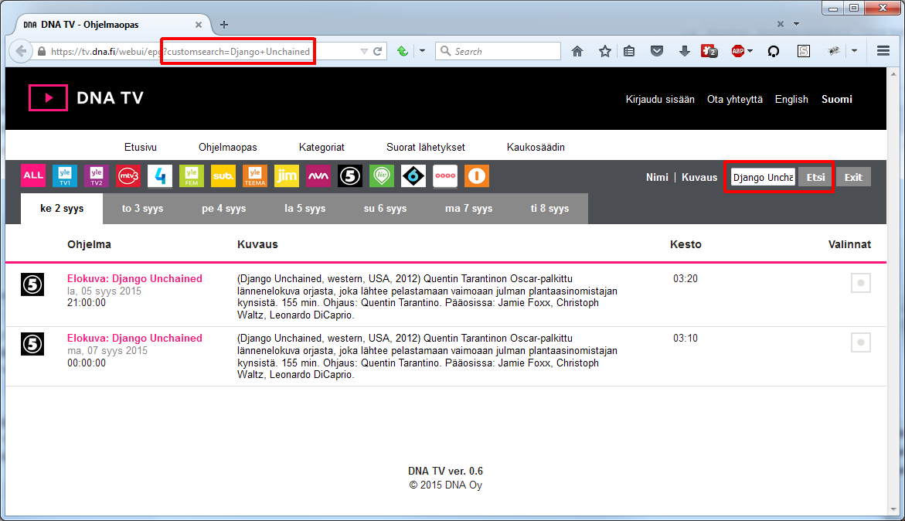

<link rel="stylesheet" type="text/css" href="css/readme.css" />

# DNA-TV-search-enhancements

Greasemonkey user scripts to add custom search enhancements to DNA TV website + integration to Telkku.com (new UI & claccic UI).

## TOC
<!-- MarkdownTOC autolink=true -->

- [User script to DNA TV EPG](#user-script-to-dna-tv-epg)
- [User script to Telkku.com](#user-script-to-telkkucom)
- [Installation](#installation)

<!-- /MarkdownTOC -->

## User script to DNA TV EPG

*Permalink to newest version: [DNA-TV-EPG-Custom-Search.user.js](https://github.com/KimeT/DNA-TV-search-enhancements/raw/master/DNA-TV-EPG-Custom-Search.user.js)*

This greasemonkey script adds custom [DNA TV EPG](https://tv.dna.fi/webui/epg "DNA TV - Ohjelmaopas") search functionality based on querystring. The EPG is searched after page load with search term set in customsearch parameter:

Although not necessary, this script is designed to be used together with corresponding greasemonkey script **DNA-TV-Links-to-Telkku-Programs.user.js** for [Telkku](http://www.telkku.com/ "Telkku.com").

## User script to Telkku.com

*Permalink to newest version: [DNA-TV-Links-to-Telkku-Programs.user.js](https://github.com/KimeT/DNA-TV-search-enhancements/raw/master/DNA-TV-Links-to-Telkku-Programs.user.js)*

This greasemonkey script adds link to DNA TV EPG search into [Telkku](http://www.telkku.com/ "Telkku.com") (also for [classic.telkku.com](http://classic.telkku.com/ "Telkku.com classic")) program views:

To be able to utilize this script, you need corresponding greasemonkey script **DNA-TV-EPG-Custom-Search.user.js** for [DNA TV EPG](https://tv.dna.fi/webui/epg "DNA TV - Ohjelmaopas") installed also.

## Installation

- For Firefox: install [Greasemonkey](https://addons.mozilla.org/fi/firefox/addon/greasemonkey/) extension first.
- For Chrome: install [Tampermonkey](https://chrome.google.com/webstore/detail/tampermonkey/dhdgffkkebhmkfjojejmpbldmpobfkfo) extension first.

Install user scripts by clicking these links with Firefox / Chrome:

- DNA TV EPG user script: [DNA-TV-EPG-Custom-Search.user.js](https://github.com/KimeT/DNA-TV-search-enhancements/raw/master/DNA-TV-EPG-Custom-Search.user.js)
- Telkku.com user script: [DNA-TV-Links-to-Telkku-Programs.user.js](https://github.com/KimeT/DNA-TV-search-enhancements/raw/master/DNA-TV-Links-to-Telkku-Programs.user.js)